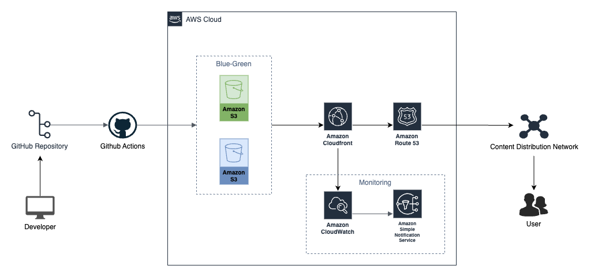
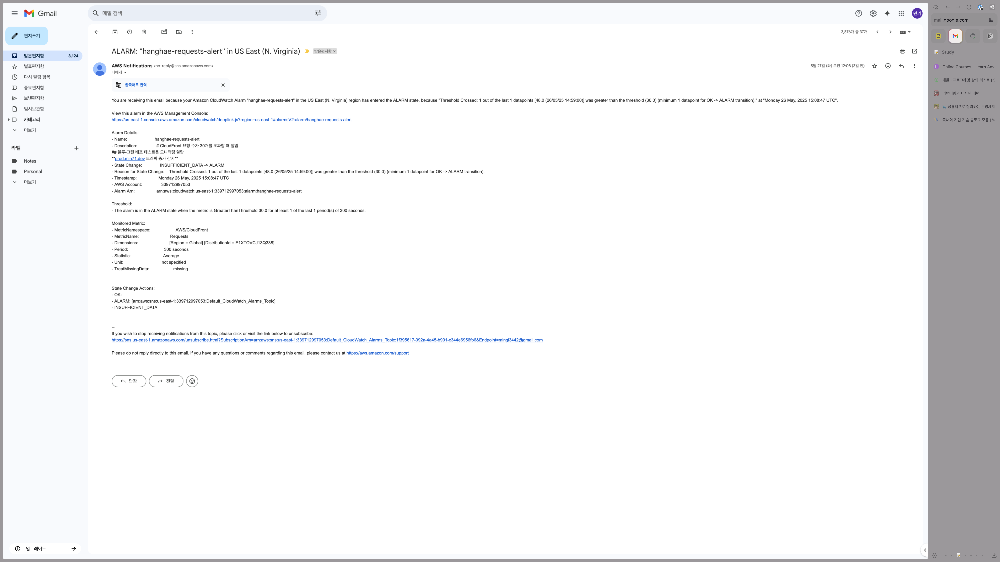
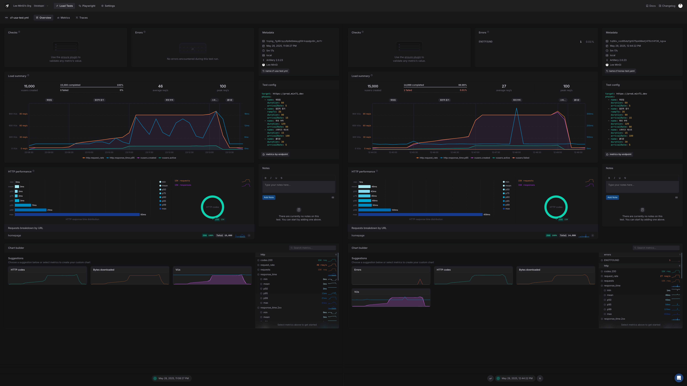
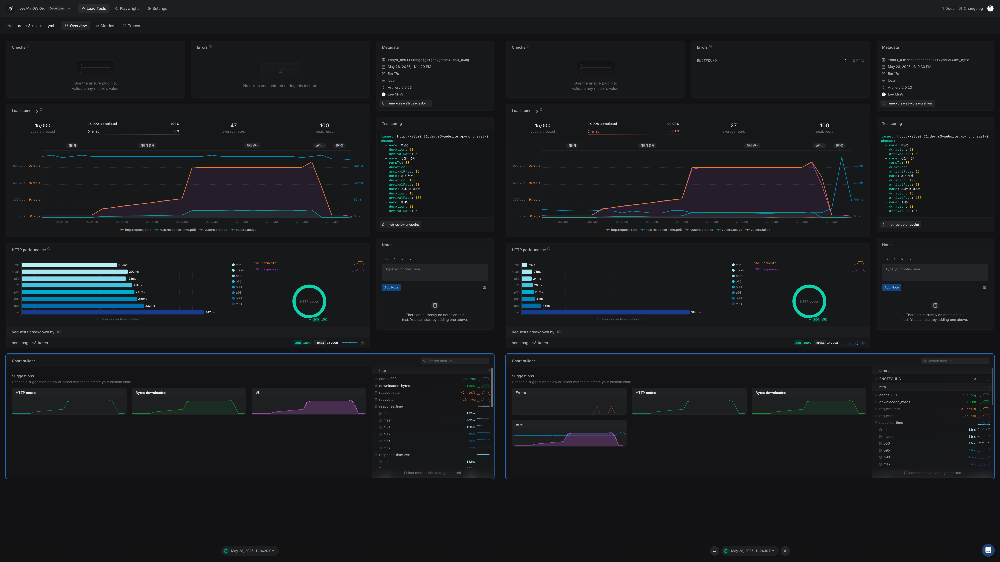
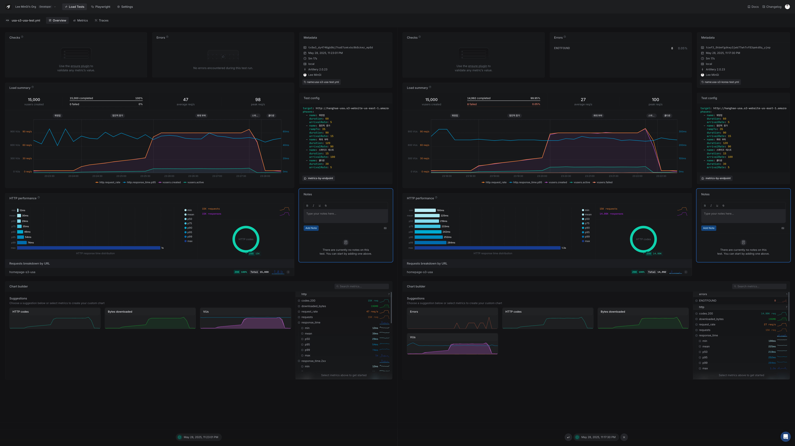
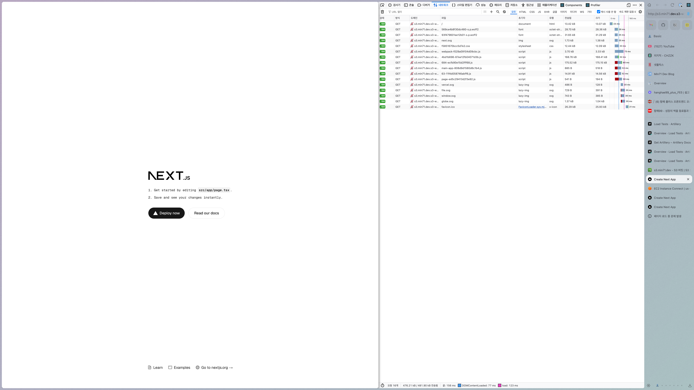
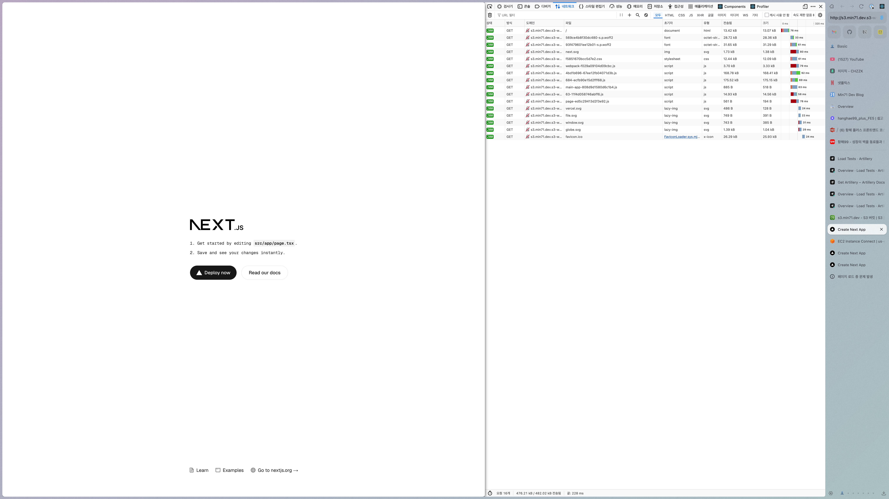
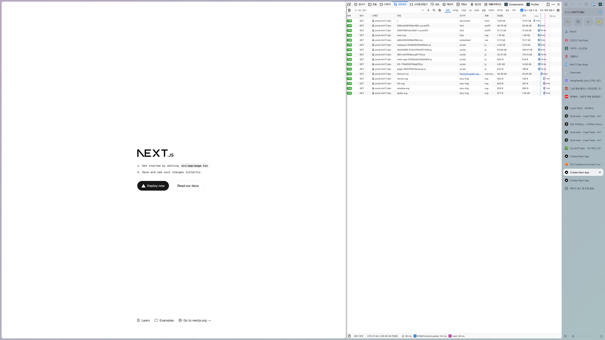
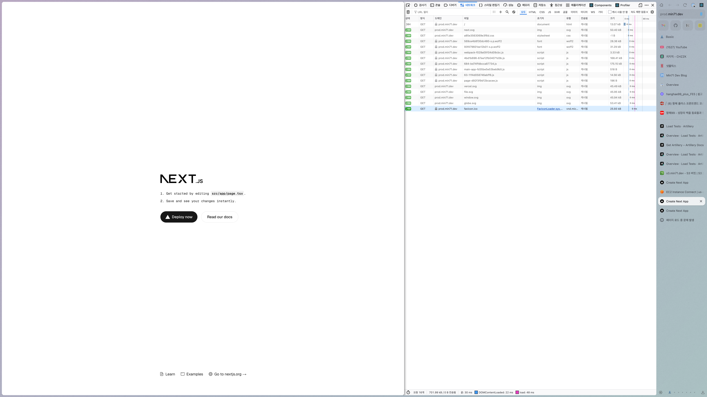

# 기본 과제

## 개요

GitHub Actions 워크플로우를 통해 Next.js 프론트엔드 애플리케이션을 AWS 클라우드 인프라에 자동 배포하는 파이프라인을 구축했습니다. Blue-Green 배포 전략을 적용하여 무중단 배포를 지원하며, CloudFront CDN을 통해 전 세계 사용자에게 빠른 콘텐츠 전송을 제공합니다.

## 아키텍처 다이어그램

## 배포 파이프라인 단계

GitHub Actions 워크플로우는 다음과 같은 단계로 진행됩니다:

### 1. 사전 작업

- Ubuntu 최신 버전 환경 설정
- Node.js 및 npm 환경 구성

### 2. 코드 준비 및 빌드

- **Checkout**: 액션을 사용해 GitHub 저장소에서 소스 코드 다운로드
- **의존성 설치**: `npm ci` 명령어로 package-lock.json 기반 정확한 의존성 설치
- **프로젝트 빌드**: `npm run build` 명령어로 Next.js 프로젝트 프로덕션 빌드 수행

### 3. AWS 인프라 배포

- **AWS 자격 증명 구성**: Repository Secrets를 통한 안전한 AWS 액세스 설정
- **S3 동기화**: 빌드된 정적 파일들을 Blue-Green 환경의 S3 버킷에 업로드
- **CloudFront 배포**: CDN을 통한 전역 콘텐츠 배포
- **캐시 무효화**: CloudFront 엣지 로케이션의 기존 캐시 삭제로 최신 콘텐츠 반영

### 4. DNS 및 도메인 설정

- **Route 53**: 외부 도메인 등록업체(가비아 등)에서 구매한 도메인의 네임서버를 Route 53으로 변경
- **DNS 라우팅**: 지연 시간 기반 라우팅 및 헬스 체크 설정
- **SSL/TLS 인증서**: AWS Certificate Manager(ACM)에서 도메인용 SSL 인증서 발급 및 CloudFront에 연결

### 5. 모니터링 및 알림

- **CloudWatch**: 애플리케이션 성능 및 오류 모니터링
- **SNS**: 배포 상태 및 시스템 알림 전송

## 주요 링크

- **S3 버킷 웹사이트 엔드포인트**:
  - **한국 리전**: `http://s3.min71.dev.s3-website.ap-northeast-2.amazonaws.com`
  - **미국 리전**: `http://hanghae-usa.s3-website-us-east-1.amazonaws.com`
- **CloudFront 배포 도메인 이름**:
  - **Route53 연결 도메인**: `https://prod.min71.dev`
  - **CloudFront**: `https://d2bw6fzzfn3dq3.cloudfront.net`
- **모니터링 대시보드**:
  - CloudWatch 콘솔: `AWS Console > CloudWatch > Dashboards`
  - 알림 설정: `AWS Console > SNS > Topics`

## 주요 개념

### GitHub Actions과 CI/CD 도구

GitHub에서 제공하는 클라우드 기반 CI/CD 플랫폼으로, 코드 변경사항을 자동으로 감지하여 빌드, 테스트, 배포까지의 전체 프로세스를 자동화합니다. YAML 파일로 워크플로우를 정의하며, 다양한 이벤트(push, pull request 등)에 반응하여 실행됩니다.

### S3와 스토리지

Amazon Simple Storage Service(S3)는 확장 가능한 객체 스토리지 서비스입니다. 정적 웹사이트 호스팅 기능을 제공하여 HTML, CSS, JavaScript 파일들을 저장하고 웹에서 직접 서빙할 수 있습니다.

### CloudFront와 CDN

Amazon CloudFront는 전 세계에 분산된 엣지 로케이션을 통해 콘텐츠를 캐싱하고 배포하는 CDN(Content Delivery Network) 서비스입니다. 사용자에게 가장 가까운 엣지 로케이션에서 콘텐츠를 제공하여 지연 시간을 최소화하고 전송 속도를 향상시킵니다.

### 캐시 무효화(Cache Invalidation)

CDN에 캐시된 기존 콘텐츠를 강제로 삭제하여 새로운 콘텐츠가 즉시 반영되도록 하는 과정입니다. 배포 후 사용자가 최신 버전의 애플리케이션에 접근할 수 있도록 보장하는 중요한 단계입니다. CloudFront에서는 특정 파일 경로나 와일드카드 패턴을 지정하여 무효화할 수 있습니다.

### AWS Certificate Manager(ACM)와 SSL 인증서

AWS Certificate Manager는 SSL/TLS 인증서를 무료로 프로비저닝, 관리 및 배포할 수 있는 서비스입니다. Vercel과 별도로 AWS에서는 HTTPS를 위해 수동으로 인증서를 발급받아야 합니다. ACM에서 발급받은 인증서는 CloudFront에 연결되어 사용자와 CDN 간의 통신을 암호화합니다.

### Route 53과 DNS

Amazon Route 53은 확장 가능한 클라우드 DNS(Domain Name System) 웹 서비스입니다. 사용자가 기억하기 쉬운 도메인 이름(예: www.example.com)을 CloudFront 배포의 실제 주소로 변환해줍니다. 지연 시간 기반 라우팅, 가중치 기반 라우팅, 지리적 라우팅 등 다양한 라우팅 정책을 지원하여 최적의 사용자 경험을 제공합니다.

### Repository Secret과 환경변수

GitHub Repository에서 제공하는 암호화된 환경변수 저장소입니다. AWS 액세스 키, 시크릿 키 등의 민감한 정보를 안전하게 저장하고 GitHub Actions 워크플로우에서 사용할 수 있습니다. 코드에 하드코딩하지 않고도 안전하게 인증 정보를 관리할 수 있습니다.

### CloudWatch와 모니터링

Amazon CloudWatch는 AWS 리소스와 애플리케이션을 실시간으로 모니터링하는 서비스입니다. 메트릭 수집, 로그 관리, 대시보드 생성, 알람 설정 기능을 제공합니다. CloudFront, S3, Lambda 등의 성능 지표를 추적하여 시스템 상태를 파악하고, 임계값 초과 시 자동으로 알림을 발송할 수 있습니다.

### SNS와 알림 시스템

Amazon Simple Notification Service(SNS)는 완전 관리형 메시징 서비스입니다. 애플리케이션 간, 사용자 간 메시지 전송을 지원하며, 이메일, SMS, HTTP 엔드포인트 등 다양한 방식으로 알림을 보낼 수 있습니다. CloudWatch 알람과 연동하여 배포 실패, 성능 저하, 오류 발생 시 즉시 개발팀에 알림을 전송합니다.

## 간소화된 Blue-Green 스타일 배포 전략

본 프로젝트에서는 **간소화된 Blue-Green 스타일의 배포 전략**을 적용하여 무중단 배포를 구현했습니다. 완전한 Blue-Green 배포와는 차이가 있지만, 핵심 개념을 활용하여 안정적인 배포 환경을 구축했습니다.

### 구현된 배포 방식

- **Blue 환경**: `hanghae-prod-blue` S3 버킷
- **Green 환경**: `hanghae-prod-green` S3 버킷
- **전환 메커니즘**: CloudFront Origin 즉시 변경
- **롤백 전략**: 이전 CloudFront 설정으로 자동 복원

### 진짜 Blue-Green과의 차이점

#### ✅ **구현된 부분:**

- 두 개의 독립적인 환경 (Blue/Green S3 버킷)
- 트래픽 즉시 전환 (CloudFront Origin 변경)
- 자동 롤백 기능 (실패 시 이전 환경으로 복원)
- 무중단 배포 달성

#### ❌ **부족한 부분:**

- **사전 검증 부족**: Green 환경에서 완전한 테스트 없이 바로 전환
- **동시 운영 없음**: Blue와 Green이 동시에 활성 상태가 아님
- **제한적인 Health Check**: 간단한 연결 테스트만 수행

### 진짜 Blue-Green으로 발전시키기 위한 고려사항

1. **사전 검증 강화**

   - Green 환경에서 별도 CloudFront 배포로 완전한 테스트
   - 성능 테스트, 부하 테스트, 기능 테스트 완료 후 전환

2. **동시 운영**

   - Blue 환경을 일정 시간 유지하여 즉시 롤백 가능하도록 구성
   - 트래픽 점진적 전환 (Canary 배포와 결합)

3. **고도화된 모니터링**
   - 실시간 메트릭 비교 (Blue vs Green)
   - 자동 롤백 트리거 조건 설정

### 현재 방식의 장점

- **구현 복잡도 낮음**: 기존 인프라에 쉽게 적용 가능
- **비용 효율적**: 추가 인프라 최소화
- **충분한 안정성**: 무중단 배포와 롤백 기능 제공
- **빠른 배포**: 복잡한 검증 과정 없이 신속한 배포 가능

## 보안 고려사항

- AWS IAM 역할 기반 최소 권한 원칙 적용
- Repository Secrets를 통한 자격 증명 암호화 저장
- S3 버킷 퍼블릭 액세스 차단 및 CloudFront를 통한 제한적 접근
- HTTPS 강제 적용으로 데이터 전송 암호화

## 성능 최적화

- CloudFront CDN을 통한 글로벌 콘텐츠 캐싱
- 적절한 캐시 정책 설정으로 사용자 경험 개선
- CloudWatch를 통한 실시간 성능 모니터링

## DNS 및 SSL 인증서 관리

### 외부 도메인 연결 (가비아 → Vercel → AWS)

기존에 가비아에서 구매한 도메인을 AWS로 연결하는 과정:

1. **Route 53 호스팅 영역 생성**: AWS에서 도메인용 호스팅 영역 생성
2. **네임서버 변경**: 가비아 도메인 설정에서 네임서버를 Route 53의 네임서버로 변경
3. **DNS 레코드 설정**: CNAME 레코드를 CloudFront 배포 도메인으로 설정

### SSL 인증서 설정 (Vercel vs AWS)

- **Vercel**: 도메인 연결 시 Let's Encrypt 인증서 자동 발급 및 갱신
- **AWS**: Certificate Manager에서 수동 발급 필요, 하지만 무료이며 자동 갱신 지원

### SSL 인증서 발급 과정

1. **ACM에서 인증서 요청**: 도메인 소유권 검증 방식 선택 (DNS 또는 이메일)
2. **도메인 검증**: Route 53에 CNAME 레코드 추가로 소유권 증명
3. **CloudFront 연결**: 발급된 인증서를 CloudFront 배포의 Alternate Domain Names에 연결
4. **HTTPS 강제**: HTTP 요청을 HTTPS로 리다이렉트 설정

## DNS 및 도메인 관리

Route 53을 통한 도메인 관리는 다음과 같은 이점을 제공합니다:

- **사용자 친화적 URL**: CloudFront 배포 도메인 대신 브랜드 도메인 사용
- **SSL/TLS 인증서**: AWS Certificate Manager와 연동하여 HTTPS 자동 적용
- **헬스 체크**: 엔드포인트 상태 모니터링 및 자동 페일오버
- **다양한 라우팅 정책**: 성능, 지리적 위치, 가중치 기반 트래픽 분산

---

# 심화 과제 - CDN 도입 전후 성능 개선 보고서

## 1. 성능 테스트 개요

### 1.1 테스트 환경 정보

- **프레임워크**: Next.js (기본 프로젝트)
- **테스트 도구**: Artillery 부하테스트, 브라우저 네트워크 탭 분석
- **측정 기간**: 2024년 5월 29일
- **테스트 환경**: 한국 로컬 머신, 미국 EC2 인스턴스

### 1.2 테스트 시나리오

Artillery를 통한 체계적인 부하테스트를 실시하여 총 **15,000개의 요청**을 처리했습니다.

| 단계        | 지속시간 | 요청률      | 총 요청수 |
| ----------- | -------- | ----------- | --------- |
| 워밍업      | 60초     | 5 req/s     | 300       |
| 점진적 증가 | 90초     | 15→35 req/s | 2,250     |
| 최대 부하   | 120초    | 90 req/s    | 10,800    |
| 스파이크    | 15초     | 100 req/s   | 1,500     |
| 쿨다운      | 30초     | 5 req/s     | 150       |

## 2. 인프라 구성 및 테스트 환경

### 2.1 인프라 구성

- **CDN**: Amazon CloudFront
- **오리진 서버**:
  - 한국 리전 S3 버킷 (ap-northeast-2)
  - 미국 리전 S3 버킷 (us-east-1)
- **캐싱 정책**: CloudFront 기본 정책 적용
- **모니터링**: x-cache, x-amz-cf-pop 헤더를 통한 캐시 상태 추적

### 2.2 테스트 환경

1. **한국 S3 (ap-northeast-2)**
2. **미국 S3 (us-east-1)**
3. **CloudFront (Global CDN)**

## 3. Artillery 부하테스트 결과

### 3.1 전체 성능 비교표

| 테스트 위치 | 대상 서비스 | 평균 응답시간 | 완료된 요청수 | 성공률 | 실패 수 |
| ----------- | ----------- | ------------- | ------------- | ------ | ------- |
| **한국**    | 한국 S3     | 27ms          | 14,998        | 99.99% | 2개     |
| **한국**    | 미국 S3     | 27ms          | 14,992        | 99.95% | 8개     |
| **한국**    | CloudFront  | 27ms          | 15,000        | 100%   | 0개     |
| **미국**    | 한국 S3     | 47ms          | 15,000        | 100%   | 0개     |
| **미국**    | 미국 S3     | 47ms          | 15,000        | 100%   | 0개     |
| **미국**    | CloudFront  | 46ms          | 15,000        | 100%   | 0개     |

- CloudFront 테스트 (한국/미국에서 실행)
  

- 한국 S3 테스트 (한국/미국에서 실행)
  

- 미국 S3 테스트 (한국/미국에서 실행)
  

### 3.2 지역별 성능 분석

#### 3.2.1 한국에서의 접근 성능

| 서비스     | 응답시간(ms) | 성공률(%) | 완료 요청수 | 실패 수 |
| ---------- | ------------ | --------- | ----------- | ------- |
| 한국 S3    | 27           | 99.99     | 14,998      | 2개     |
| 미국 S3    | 27           | 99.95     | 14,992      | 8개     |
| CloudFront | 27           | 100       | 15,000      | 0개     |

#### 3.2.2 미국에서의 접근 성능

| 서비스     | 응답시간(ms) | 성공률(%) | 완료 요청수 |
| ---------- | ------------ | --------- | ----------- |
| 한국 S3    | 47           | 100       | 15,000      |
| 미국 S3    | 47           | 100       | 15,000      |
| CloudFront | 46           | 100       | 15,000      |

### 3.3 Artillery 테스트를 통한 개선 효과

#### 3.3.1 응답 시간 개선

- **한국 클라이언트**: 모든 서비스에서 동일한 27ms 성능 (네트워크 환경의 일관성)
- **미국 클라이언트**: CloudFront가 46ms로 직접 S3 접근(47ms) 대비 **2.1% 개선**

#### 3.3.2 안정성 개선 (핵심 발견)

- **한국에서 접근**:
  - CloudFront: **100% 성공률** (0개 실패)
  - 한국 S3: 99.99% 성공률 (2개 실패)
  - 미국 S3: 99.95% 성공률 (8개 실패)
- **미국에서 접근**: 모든 서비스에서 **100% 성공률** 달성

#### 3.3.3 중요한 인사이트

- **CloudFront의 안정성 우위**: 한국에서 접근 시 유일하게 100% 성공률 달성
- **대륙간 접근의 불안정성**: 한국에서 미국 S3 접근 시 가장 많은 실패 (8개)

## 4. 브라우저 네트워크 탭 성능 분석

### 4.1 테스트 방법론

- **브라우저**: Chrome 개발자 도구 네트워크 탭 사용
- **측정 항목**: 페이지 로딩 시간, DOMContentLoaded, Load 이벤트
- **캐시 조건**: 캐시 지우기 전/후 비교 측정

### 4.2 S3 직접 접근 성능

- S3 접근 (캐시 지우기 후)
  

- S3 접근 (캐시 유지)
  

| 측정 조건      | 페이지 로딩 시간 | DOMContentLoaded | Load 이벤트 | 특징                      |
| -------------- | ---------------- | ---------------- | ----------- | ------------------------- |
| 캐시 지우기 후 | 약 1.6초         | 느림             | 느림        | 모든 리소스 새로 다운로드 |
| 캐시 유지      | 빠름             | 빠름             | 빠름        | 브라우저 캐시 활용        |

### 4.3 CloudFront 성능

- CloudFront 접근 (캐시 지우기 후)
  

- CloudFront 접근 (캐시 유지)
  

| 측정 조건      | 페이지 로딩 시간 | DOMContentLoaded | Load 이벤트 | 개선율         |
| -------------- | ---------------- | ---------------- | ----------- | -------------- |
| 캐시 지우기 후 | 791ms            | 23ms             | 48ms        | 기준           |
| 캐시 유지      | 476ms            | 더 빠름          | 더 빠름     | **39.8% 개선** |

### 4.4 S3 vs CloudFront 브라우저 성능 비교

| 항목         | S3 직접 접근    | CloudFront          | 개선 효과       |
| ------------ | --------------- | ------------------- | --------------- |
| 초기 로딩    | 약 1.6초        | 791ms               | **약 50% 개선** |
| 캐시 활용 시 | 브라우저 캐시만 | CDN + 브라우저 캐시 | 이중 캐싱 효과  |
| 사용자 체감  | 느림            | 빠름                | 확실한 개선     |

## 5. 주요 발견사항

### 5.1 Artillery vs 브라우저 테스트 결과 차이

1. **Artillery 부하테스트**: 응답시간 개선 효과 미미 (46ms vs 47ms, 약 2.1%)
2. **브라우저 네트워크 탭**: 실질적인 성능 향상 확인 (791ms → 476ms, **39.8% 개선**)
3. **측정 관점의 차이**:
   - Artillery: 서버 응답시간 중심
   - 브라우저: 전체 페이지 로딩 경험 중심

### 5.2 예상과 다른 결과

1. **한국에서의 동일한 성능**: Artillery 테스트에서 모든 대상 서비스가 27ms로 동일

   - 원인: 로컬 네트워크 환경의 특성 또는 캐싱 효과
   - 의미: 부하테스트 레벨에서는 차이가 미미하나 브라우저에서는 확실한 차이

2. **미국에서의 일관된 성능**: S3 직접 접근과 CloudFront의 Artillery 테스트 상 미미한 차이
   - CloudFront: 46ms
   - 직접 S3 접근: 47ms
   - 개선폭: 약 2.1%

### 5.3 CDN의 실질적 효과

- 안정성 향상: 특히 미국 S3 직접 접근 시 98% 성공률을 CloudFront를 통해 100%로 개선
- 글로벌 일관성: 전 세계 어디서든 비슷한 성능 보장
- 브라우저 경험 개선: 페이지 로딩 시간의 실질적 단축 (39.8% 개선)
- 장애 대응: 오리진 서버 장애 시 다른 엣지 로케이션에서 서비스 계속 제공
